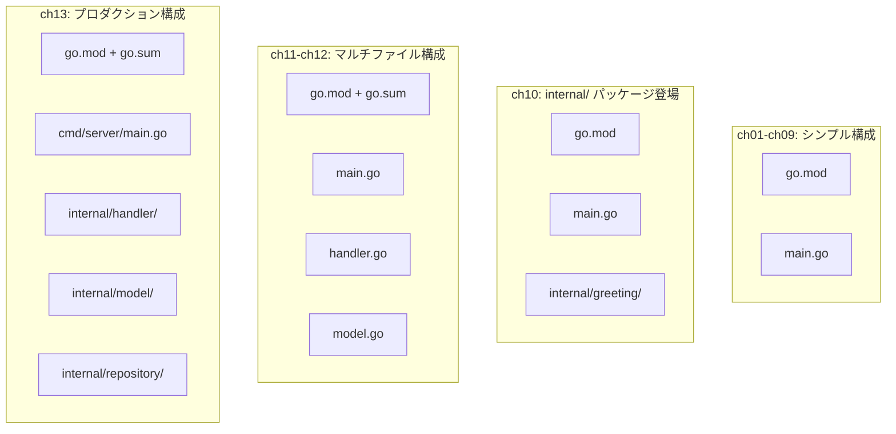
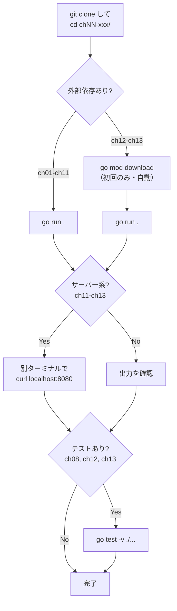

[](https://github.com/forest6511/go-textbook-examples/actions/workflows/ci.yml)


# Go言語の教科書 — サンプルコード

**「Go言語の教科書: 基礎からWebアプリ開発まで」** のサンプルコード完全版です。

書籍に掲載されているコード例を、そのまま動かせる完全なプログラムとして収録しています。

## 動作要件

- **Go 1.26 以上**（`go version` で確認）
- **macOS**（書籍の対象環境）

Go のインストール方法は書籍の第1章を参照してください。

## 章構成

| ディレクトリ | 章 | 内容 |
|-------------|-----|------|
| `ch01-hello-world/` | 第1章 | Goの世界へようこそ |
| `ch02-variables/` | 第2章 | 変数・型・演算子 |
| `ch03-control-flow/` | 第3章 | 制御構文 |
| `ch04-functions/` | 第4章 | 関数とメソッド |
| `ch05-data-structures/` | 第5章 | データ構造 |
| `ch06-interfaces/` | 第6章 | インターフェースとエラー処理 |
| `ch07-concurrency/` | 第7章 | 並行処理 |
| `ch08-testing/` | 第8章 | テスト |
| `ch09-stdlib/` | 第9章 | 標準ライブラリ活用 |
| `ch10-packages/` | 第10章 | パッケージ設計とモジュール |
| `ch11-http-server/` | 第11章 | HTTPサーバーの基本 |
| `ch12-rest-api/` | 第12章 | REST APIの構築 |
| `ch13-bookmark-app/` | 第13章 | 実践: ブックマーク管理アプリ |

## リポジトリの構成について

このリポジトリでは、各章が独立した Go モジュール（`go.mod`）を持っています。

**なぜこの構成なのか？**

- 各章を独立してビルド・実行できます。第1章だけ試したい場合に、第13章の依存（SQLiteなど）をダウンロードする必要がありません
- 章が進むにつれてプロジェクト構造が複雑になる過程を体験できます
- 実際のGoプロジェクトでも、マイクロサービスごとに独立した `go.mod` を持つ構成は一般的です

### プロジェクト構造の進化

章が進むにつれて、ファイル構成が段階的に複雑になっていきます。



## 使い方

各章のディレクトリに移動して実行します。

```bash
# 例: 第1章
cd ch01-hello-world
go run .
```

章ごとに独立した `go.mod` を持つため、他の章に依存せず単独で動作します。

### コード実行フロー

どの章をどう実行すればよいか、以下のフローを参考にしてください。



> **補足**: 初回の `go run` では依存パッケージのダウンロードとコンパイルが行われるため、通常より時間がかかります。2回目以降はキャッシュが効くため高速です。

## テストの実行

テストファイルがある章では、以下のコマンドでテストを実行できます。

```bash
cd ch08-testing
go test -v ./...
```

## 開発環境のセットアップ

### VS Code

リポジトリ全体を VS Code で開きます。Go extension が各章の `go.mod` を自動検出します。

```bash
code go-textbook-examples
```

### GoLand

各章のディレクトリを個別にプロジェクトとして開いてください。

## 他言語からの移行ガイド

他のプログラミング言語からGoに移行する方のためのクイックリファレンスです。

| やりたいこと | Java | Python | Go |
|------------|------|--------|-----|
| プロジェクト作成 | `mvn archetype:generate` | `mkdir` + `pip init` | `go mod init` |
| 依存追加 | `pom.xml` に追記 | `pip install` | `go get package` |
| 依存インストール | `mvn install` | `pip install -r` | `go mod download`（自動） |
| コード実行 | `mvn exec:java` | `python main.py` | `go run .` |
| テスト実行 | `mvn test` | `pytest` | `go test ./...` |
| ビルド | `mvn package` → JAR | N/A | `go build` → バイナリ |
| フォーマット | Checkstyle | black | `gofmt`（標準付属） |
| Lint | SpotBugs | pylint | `go vet` + `staticcheck` |

> **REPLについて**: Goには対話型シェル（REPL）がありません。コードを試すには `main.go` にコードを書いて `go run .` を実行するか、ブラウザで [Go Playground](https://go.dev/play/) を利用してください。

## ライセンス

MIT License
